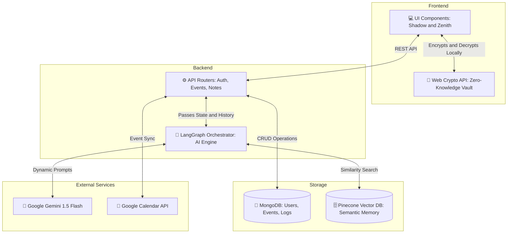

<div align="center">

# 🌑 Shadow - AI Second Brain & Life OS

<p align="center">
  
  
  
  
</p>

<p align="center">
  
</p>


<br />

**Shadow** is a context-aware **AI Life Organizer** that helps you log your life, manage tasks, and recall memories. It combines a **Timeline Stream**, **Zero-Knowledge Encrypted Notes**, and an **AI Assistant** that learns from your history.

</div>

---


## ✨ Key Features

### 🧠 1. AI-Powered Memory (RAG)

Shadow doesn't just store text; it _understands_ it.

- **Automatic Vector Embedding:** When you log a **"Rant"** (with high stress > 7) or a key **"Idea"**, Shadow automatically embeds it into a local **Pinecone Vector Database**.
- **Contextual Recall:** The Chat Assistant can retrieve past ideas or emotional patterns using Semantic Search.
- _User:_ "What were my recent business ideas?"
- _Shadow:_ Retrieves relevant logs from weeks ago using vector similarity.

### 🔒 2. Zero-Knowledge "Secret Mode"

Your private thoughts should remain private.

- **Client-Side Encryption:** Notes marked as "Secret" are encrypted **in your browser** using **AES-GCM (256-bit)** before they ever touch the server.
- **Unique Salting:** Uses **PBKDF2** with a unique, server-generated salt per user to prevent rainbow table attacks.
- **No-Knowledge Server:** The backend only sees gibberish (`U2FsdGVk...`). If you lose your password, the data is gone forever.

### 📝 3. Intelligent Timeline & Journaling

- **Stream Types:** Log `Activities`, `Rants`, or `Ideas`.
- **AI Analysis:** Every entry is analyzed for **Impact Score (1-10)**, **Tags**, and **Sentiment**.
- **Voice-to-Text:** Native browser speech recognition for hands-free logging.
- **Daily Recap:** One-click AI summary of your entire day's timeline.

### 📅 4. Natural Language Scheduling

- **Command:** "Schedule a meeting with John for Project X tomorrow at 10 AM."
- **Action:** Shadow parses the intent and creates an event in your **Upcoming Events** list.
- **Google Calendar Sync:** Two-way sync to keep your real life aligned.

---

## 🏗️ Architecture



| Component     | Tech Stack                           | Description                                               |
| ------------- | ------------------------------------ | --------------------------------------------------------- |
| **Frontend**  | React, Vite, Tailwind, Framer Motion | Modern, responsive UI with "Professional" & "Life" modes. |
| **Backend**   | Python, FastAPI                      | High-performance API handling auth, AI logic, and CRUD.   |
| **Database**  | MongoDB (Motor)                      | Stores Users, Logs, Notes, and Events.                    |
| **Vector DB** | Pinecone + Google GenAI Embeddings   | Stores embeddings for semantic search (Long-term memory). |
| **AI Engine** | Google Gemini 1.5 Flash & LangChain  | Powers reasoning, text classification, and RAG chat.      |
| **Auth/Crypto**| JWT, Argon2, Web Crypto API        | Argon2 for passwords, JWT for sessions, AES-GCM for notes..|

---

## 🚀 Getting Started

### Prerequisites

- **Docker & Docker Compose** (Recommended)
- OR **Node.js 18+** & **Python 3.10+** (Manual)
- **Google Gemini API Key** (Get one [here](https://aistudio.google.com/))
- **MongoDB Atlas URI** (or local Mongo)
- **Pinecone API Key** (Get one [here](https://www.pinecone.io/))

### 🛠️ Option 1: Docker (Fastest)

1. **Clone the repo:**

```bash
git clone https://github.com/pgauin01/shadow.git
cd shadow

```

2. **Create `.env` file:**

```bash
cp .env.example .env
# Edit .env to add your keys (See Environment Variables below)

```

3. **Run with Compose:**

```bash
docker-compose -f docker-compose.prod.yml up --build -d

```

- Frontend: `http://localhost:80`
- Backend: `http://localhost:8000`

### 🛠️ Option 2: Manual Installation

#### Backend

```bash
python -m venv venv
source venv/bin/activate  # or venv\Scripts\activate on Windows
pip install -r ../requirements.txt
uvicorn app.main:app --reload

```

#### Frontend

```bash
cd shadow-client
npm install
npm run dev

```

---

## 🛡️ Environment Variables (`.env`)

Create a `.env` file in the root directory:

```env
# Database Configuration
MONGO_URL=mongodb://localhost:27017

# AI & Embeddings
GOOGLE_API_KEY=your_google_api_key_here
PINECONE_API_KEY=your_pinecone_api_key_here

# Security Settings
SECRET_KEY=shadow_super_secret_key_change_me
ALGORITHM=HS256

# Deployment (Optional)
HOST_IP=34.135.8.240
HOST_USER=your_username

```

---

## Google Calendar Integration (client_secret.json)

To enable syncing with Google Calendar, you must create OAuth 2.0 Client IDs in the Google Cloud Console. Download the JSON file and save it exactly as client_secret.json in your project's working directory.

# Format Example:
```json
{
  "web": {
    "client_id": "your-client-id.apps.googleusercontent.com",
    "project_id": "your-project-id",
    "auth_uri": "[https://accounts.google.com/o/oauth2/auth](https://accounts.google.com/o/oauth2/auth)",
    "token_uri": "[https://oauth2.googleapis.com/token](https://oauth2.googleapis.com/token)",
    "auth_provider_x509_cert_url": "[https://www.googleapis.com/oauth2/v1/certs](https://www.googleapis.com/oauth2/v1/certs)",
    "client_secret": "your-client-secret",
    "javascript_origins": ["http://localhost:8000"]
  }
}
```

## 📖 Usage Guide

### 🔐 Using the Secret Vault

1. Go to **Quick Notes**.
2. Click the **Unlock / Setup** button (Lock Icon) in the toolbar.
3. Set a **Vault Password**.
4. Toggle **"Secret"** mode ON.
5. Any note you save will be encrypted.
6. **Refresh the page** to lock the vault again.

### 🗣️ Voice Input

1. Click the **Microphone** icon in the Chat or Timeline input.
2. Speak your log (e.g., _"I'm feeling really stressed about the deadline because..."_).
3. Shadow captures the text. If it detects high stress (>7), it tags it as a **Rant** and saves it to the Vector DB for later therapy/analysis.

### 🧠 RAG / Memory Recall

1. Open the **Chat Assistant**.
2. Ask: _"Why was I stressed last week?"_
3. Shadow queries the **Pinecone** index, finds the relevant "Rant" logs, and summarizes the cause.

---

## 🤝 Contributing

Pull requests are welcome! For major changes, please open an issue first to discuss what you would like to change.

## 📄 License

[MIT](https://choosealicense.com/licenses/mit/)
